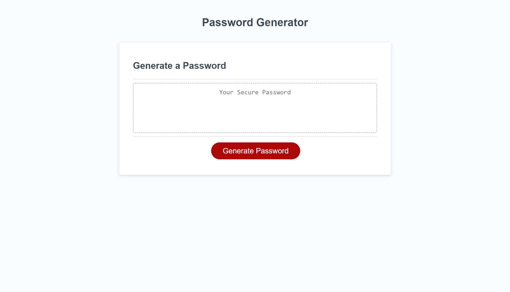
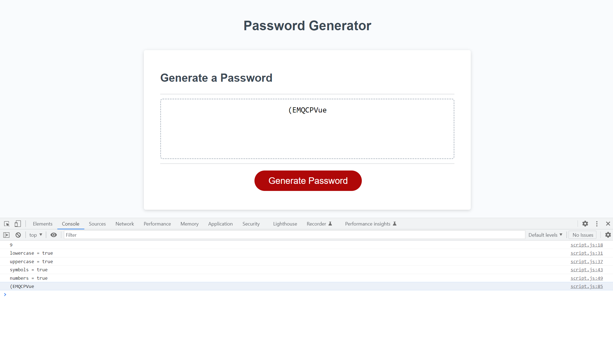

# Kate Steed Random Password Generator

## Description

This is the finished product for our Module 3 Challenge; a random password generator. The goal of this project was for students to use their knowledge of Javascript to add code to a starter file to create a functional password generator that used user imput as parameters for each password. Students were given an already completed html and css file, but needed to come up with their own javascript code to make the password generator work.

## Instaliation

N/A

## Usage

In order to use the random password generator, simply press the "generate password" button. Follow the instructions in the window prompts to set up parameters for your password. Once all questions are answered, your newly generated password will appear inside the textbox. You can also open the console and find your password there. 

https://ksteed8859.github.io/KS-RPG/

## Credits

Starter code was pulled from https://github.com/coding-boot-camp/friendly-parakeet

## License

N/A

